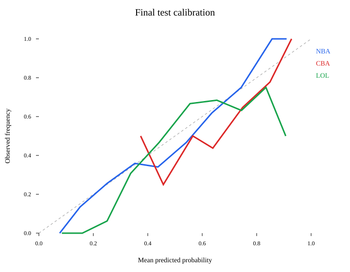

# 预测市场模型严格样本外回测报告

生成日期：2026-08-10  
结论状态：**不通过，禁止用于真实资金自动下注**

## 1. 结论

本轮优化没有证明正期望。三个市场在验证集上全部为负，冻结模型后只运行一次的最终隔离测试也全部为负。最终测试合计 232 笔交易、成交本金 1,621.17 个基准单位、净亏损 180.20，净 ROI 为 **-11.12%**。因此不能声称资金会正曲线增长，也不能用 8,000 RMB 本金部署该版本。

“ROI ≥60%”不是合理的模型验收承诺。可验证的验收标准应是：多个连续时间窗中，概率校准稳定、扣除成本后 ROI 为正、置信区间不跨越不可接受亏损，并且回撤满足资金管理要求。本模型没有通过最基本的正净收益条件。

## 2. 数据范围与赛事过滤

| 市场 | 纳入场次 | 训练截止 | 验证截止 | 最终隔离集 |
|---|---:|---:|---:|---:|
| NBA | 1,331 | 2026-01-31 | 2026-03-21 | 最近 267 场 |
| CBA | 330 | 2026-03-25 | 2026-04-15 | 最近 66 场 |
| LOL | 619 | 2026-04-11 | 2026-05-09 | 最近 124 场 |

LOL 原始候选 2,168 场，过滤后保留 619 场，剔除约 71.4%。仅保留 LCK、LPL、LEC、LCS 的一线官方队伍，以及 Worlds、MSI、First Stand 官方赛事窗口；学院、挑战者、次级联赛和非四大赛区的普通联赛均不纳入。国际赛事允许四大赛区之外的官方参赛队，因为 Worlds/MSI 本身要求全球赛区参赛。

数据按比赛时间严格排序，切分比例为训练 55%、验证 25%、最终测试 20%，不 shuffle。最终测试文件已经写入锁，脚本会拒绝第二次运行。

## 3. 防止数据泄露

- 盘口取开赛前 60 分钟或更早的最后可得价格。
- 当前比赛的聪明钱流只使用该截止时点前的成交。
- 钱包历史能力只在前一场比赛结算后更新；当前赛果及未来钱包表现不会回填。
- Elo 只在比赛结束后更新。
- 特征、模型与 edge 阈值只用训练集和验证集确定；最终测试在配置冻结后运行一次。
- 手续费按 Polymarket sports taker fee 函数计入，另在买价中加入 0.01 概率点滑点。
- 仓位为 1/4 Kelly，另设单笔不超过当时本金 0.75%。

## 4. “聪明钱”定义与结果

抓取的公开历史成交中，仅保留单笔名义金额至少 500 USDC 的记录：NBA 600,616 笔、CBA 5,179 笔、LOL 180,188 笔。钱包至少需要 5 场已结算历史，且历史净 ROI 为正，才进入聪明钱流；权重随历史样本数收缩，避免一次幸运交易被赋予高权重。BUY 增加方向流，SELL 减少方向流。

训练/验证选择结果：NBA 最优概率模型没有采用聪明钱特征；CBA 和 LOL 采用了该特征，但两者验证集净 ROI 仍分别为 -8.82% 和 -21.85%。这意味着当前公开成交构造出的聪明钱信号没有形成可交易 edge。可能原因包括：公开接口不能完整还原钱包全部 maker/taker 库存与跨市场对冲；大额不等于知情；钱包会拆单、做市或同时在其他平台对冲；按历史 ROI 筛选仍有幸存者偏差。

## 5. 验证集结果（未接触最终测试时的模型选择结果）

| 市场 | Brier | Log loss | 交易数 | 净 ROI | 最大回撤 | Calmar | 是否通过 |
|---|---:|---:|---:|---:|---:|---:|---|
| NBA | 0.1786 | 0.5372 | 146 | -35.60% | 32.77% | -2.87 | 否 |
| CBA | 0.1609 | 0.4899 | 61 | -8.82% | 5.59% | -9.27 | 否 |
| LOL | 0.1791 | 0.5369 | 86 | -21.85% | 16.32% | -5.13 | 否 |
| 合计 | — | — | 293 | **-25.14%** | — | — | 否 |

## 6. 最终隔离测试（仅运行一次）

| 市场 | 样本 | Brier | Log loss | 交易数 | 命中率 | 净 ROI | 最大回撤 | Calmar |
|---|---:|---:|---:|---:|---:|---:|---:|---:|
| NBA | 267 | 0.1772 | 0.5267 | 116 | 20.69% | -10.52% | 28.02% | -1.10 |
| CBA | 66 | 0.2331 | 0.6525 | 57 | 35.09% | -15.45% | 11.27% | -3.33 |
| LOL | 124 | 0.2006 | 0.5902 | 59 | 22.03% | -8.07% | 12.05% | -1.85 |
| 合计 | 457 | — | — | 232 | — | **-11.12%** | — | — |

## 7. 置信度分层后的实际准确率

| 置信区间 | NBA | CBA | LOL |
|---|---:|---:|---:|
| 0.50–0.60 | 58.44% (77) | 60.00% (20) | 61.11% (36) |
| 0.60–0.70 | 63.33% (60) | 44.44% (18) | 68.75% (32) |
| 0.70–0.80 | 74.55% (55) | 64.71% (17) | 77.14% (35) |
| 0.80–0.90 | 91.67% (60) | 77.78% (9) | 83.33% (18) |
| 0.90–1.00 | 100.00% (15) | 100.00% (2) | 66.67% (3) |

括号内为样本数。CBA 和 LOL 的高置信区间样本很少，不能据此宣称稳定优势。

## 8. 模型概率减市场隐含概率的偏离分布

| 市场 | 均值 | 标准差 | P05 | P25 | 中位数 | P75 | P95 |
|---|---:|---:|---:|---:|---:|---:|---:|
| NBA | -0.0005 | 0.0291 | -0.0483 | -0.0286 | 0.0055 | 0.0282 | 0.0338 |
| CBA | 0.0762 | 0.1606 | -0.1391 | -0.0469 | 0.0646 | 0.1862 | 0.4038 |
| LOL | 0.0172 | 0.0530 | -0.0597 | -0.0331 | 0.0109 | 0.0709 | 0.0865 |

CBA 偏离极宽且最终 Brier 恶化，说明聪明钱特征在小样本上产生了不稳定的大幅修正。NBA 模型几乎只是市场概率的轻度再校准；价格差不足以覆盖信息优势、滑点和费用。

## 9. 上线判定与下一版要求

当前版本必须保持研究模式，不推送“建议金额”，也不执行自动下注。每日推送若继续运行，应只展示赛事、盘口与风险提示，并明确“模型未通过资金部署门槛”。

下一版若要继续研究，至少需要新增以下在预测时点可获得且带可靠时间戳的数据：

1. NBA 官方伤病报告、首发、赛程休息天数和逐回合数据；CBA 对应官方名单及伤停。
2. 多家主流博彩公司同一时刻的 moneyline/让分/大小盘，记录开盘、变化路径和去水后的共识概率。
3. LOL 官方版本、首发、阵容变更、红蓝方、地图级数据，并保持四大赛区及官方国际赛白名单。
4. Polymarket 完整订单簿快照、买卖价差和可成交深度，而不只是成交历史。
5. 多个赛季的滚动前推验证；每次模型变更必须启用新的未来隔离集，不能再次使用本报告的最终段调参。

只有当连续多个验证窗均为正、概率指标不劣于市场基线、扣成本后的收益置信区间可接受，且最大回撤低于预设阈值时，才能进入小额纸面交易。真实资金阶段仍需先进行至少 8–12 周的 forward test。

## 10. 可复核产物

- 冻结配置：`frozen_config.json`
- 最终测试锁及逐笔资金曲线：`FINAL_TEST_LOCK.json`
- 校准图：`calibration.svg`
- 研究代码：`research/smart_money_model.py`

